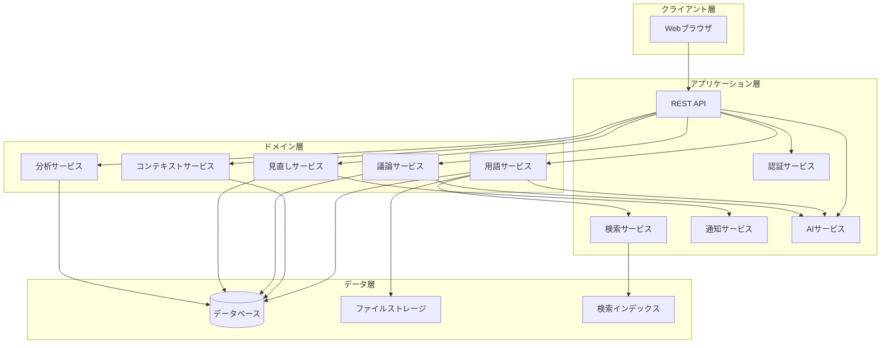
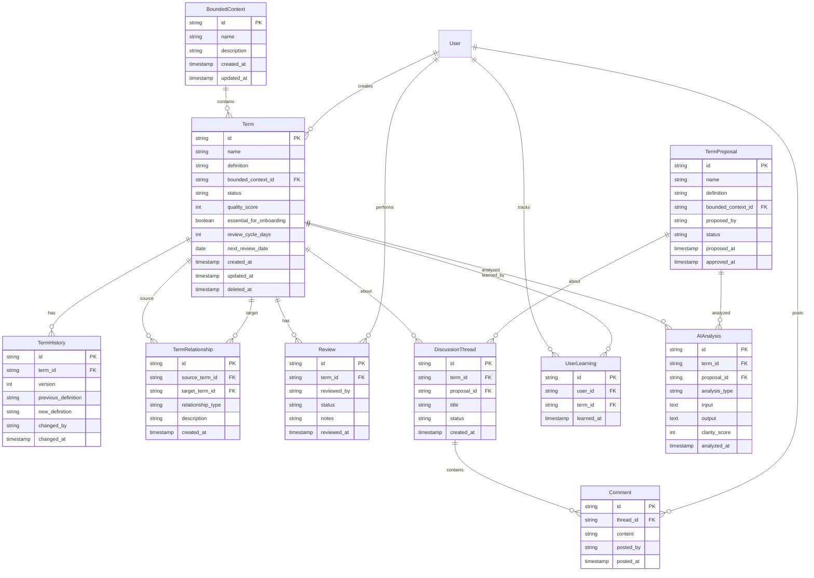

# 設計書

## 概要

ユビキタス言語システムは、DDD実践チームがドメイン用語を効果的に管理・共有・進化させるためのWebアプリケーションです。本システムは、用語の登録・検索・議論・承認・見直しのライフサイクル全体をサポートし、チームのドメイン理解を深めます。

### 設計原則

- **シンプルさ**: 直感的なUIで学習コストを最小化
- **拡張性**: 用語数の増加に対応できるスケーラブルな設計
- **トレーサビリティ**: すべての変更を追跡可能
- **協調性**: チーム全体での議論と合意形成を支援

## アーキテクチャ

### システム構成



### 技術スタック

- **フロントエンド**: Next.js + TypeScript
- **バックエンド**: Hono + TypeScript
- **データベース**: PostgreSQL
- **検索エンジン**: MeiliSearch（高速でOSSの全文検索エンジン）
- **AI統合**: OpenAI API（またはローカルLLM）
- **認証**: JWT
- **通知**: メール/Webhook

## コンポーネントとインターフェース

### 1. 用語管理コンポーネント

#### Term（用語エンティティ）

```typescript
interface Term {
  id: string;
  name: string;
  definition: string;
  boundedContextId: string;
  status: 'draft' | 'active' | 'archived';
  examples?: string[];
  usageNotes?: string;
  qualityScore: number;
  essentialForOnboarding: boolean;
  reviewCycleDays?: number;
  nextReviewDate?: Date;
  createdBy: string;
  createdAt: Date;
  updatedBy: string;
  updatedAt: Date;
  deletedAt?: Date;
}
```

#### TermHistory（用語履歴）

```typescript
interface TermHistory {
  id: string;
  termId: string;
  version: number;
  previousDefinition: string;
  newDefinition: string;
  changedFields: string[];
  changedBy: string;
  changedAt: Date;
  changeReason?: string;
}
```

#### TermService インターフェース

```typescript
interface ITermService {
  createTerm(data: CreateTermDto): Promise<Term>;
  updateTerm(id: string, data: UpdateTermDto): Promise<Term>;
  deleteTerm(id: string, userId: string): Promise<void>;
  getTerm(id: string): Promise<Term>;
  searchTerms(query: string): Promise<Term[]>;
  getTermHistory(termId: string): Promise<TermHistory[]>;
  getTermsByContext(contextId: string): Promise<Term[]>;
  markAsLearned(termId: string, userId: string): Promise<void>;
  incrementViewCount(termId: string): Promise<void>;
}
```

### 2. 境界づけられたコンテキスト管理コンポーネント

#### BoundedContext（境界づけられたコンテキストエンティティ）

```typescript
interface BoundedContext {
  id: string;
  name: string;
  description: string;
  createdBy: string;
  createdAt: Date;
  updatedAt: Date;
}
```

#### ContextService インターフェース

```typescript
interface IContextService {
  createContext(data: CreateContextDto): Promise<BoundedContext>;
  updateContext(id: string, data: UpdateContextDto): Promise<BoundedContext>;
  getContext(id: string): Promise<BoundedContext>;
  getAllContexts(): Promise<BoundedContext[]>;
  getContextWithTerms(id: string): Promise<ContextWithTerms>;
}
```

### 3. 用語関連性管理コンポーネント

#### TermRelationship（用語関係エンティティ）

```typescript
interface TermRelationship {
  id: string;
  sourceTermId: string;
  targetTermId: string;
  relationshipType: 'aggregation' | 'association' | 'dependency' | 'inheritance';
  description?: string;
  createdBy: string;
  createdAt: Date;
}
```

#### RelationshipService インターフェース

```typescript
interface IRelationshipService {
  createRelationship(data: CreateRelationshipDto): Promise<TermRelationship>;
  deleteRelationship(id: string): Promise<void>;
  getRelationships(termId: string): Promise<TermRelationship[]>;
  validateNoCircularDependency(sourceId: string, targetId: string): Promise<boolean>;
  generateDiagram(contextId?: string): Promise<DiagramData>;
}
```

### 4. 議論と承認コンポーネント

#### TermProposal（用語候補エンティティ）

```typescript
interface TermProposal {
  id: string;
  name: string;
  definition: string;
  boundedContextId: string;
  proposedBy: string;
  proposedAt: Date;
  status: 'pending' | 'approved' | 'rejected' | 'on_hold';
  approvedBy?: string;
  approvedAt?: Date;
  rejectionReason?: string;
}
```

#### DiscussionThread（議論スレッドエンティティ）

```typescript
interface DiscussionThread {
  id: string;
  termId?: string;
  proposalId?: string;
  title: string;
  createdBy: string;
  createdAt: Date;
  status: 'open' | 'closed';
}
```

#### Comment（コメントエンティティ）

```typescript
interface Comment {
  id: string;
  threadId: string;
  content: string;
  postedBy: string;
  postedAt: Date;
  updatedAt?: Date;
}
```

#### DiscussionService インターフェース

```typescript
interface IDiscussionService {
  createProposal(data: CreateProposalDto): Promise<TermProposal>;
  approveProposal(proposalId: string, approverId: string): Promise<Term>;
  rejectProposal(proposalId: string, approverId: string, reason: string): Promise<void>;
  createThread(data: CreateThreadDto): Promise<DiscussionThread>;
  addComment(threadId: string, content: string, userId: string): Promise<Comment>;
  getThread(threadId: string): Promise<ThreadWithComments>;
  closeThread(threadId: string): Promise<void>;
}
```

### 5. 見直しサイクル管理コンポーネント

#### Review（見直しエンティティ）

```typescript
interface Review {
  id: string;
  termId: string;
  reviewedBy: string;
  reviewedAt: Date;
  status: 'confirmed' | 'needs_update' | 'needs_discussion';
  notes?: string;
}
```

#### ReviewService インターフェース

```typescript
interface IReviewService {
  scheduleReview(termId: string, cycleDays: number): Promise<void>;
  getTermsDueForReview(): Promise<Term[]>;
  performReview(termId: string, userId: string, status: ReviewStatus, notes?: string): Promise<Review>;
  getReviewHistory(termId: string): Promise<Review[]>;
  sendReviewNotifications(): Promise<void>;
}
```

### 6. コード分析コンポーネント

#### CodeAnalysis（コード分析エンティティ）

```typescript
interface CodeAnalysis {
  id: string;
  fileName: string;
  uploadedBy: string;
  uploadedAt: Date;
  extractedElements: CodeElement[];
  matchRate: number;
}
```

#### CodeElement（コード要素）

```typescript
interface CodeElement {
  name: string;
  type: 'class' | 'method' | 'variable';
  matchedTermId?: string;
  suggestion?: string;
}
```

#### CodeAnalysisService インターフェース

```typescript
interface ICodeAnalysisService {
  analyzeCode(file: File, userId: string): Promise<CodeAnalysis>;
  extractElements(code: string): Promise<CodeElement[]>;
  matchWithTerms(elements: CodeElement[]): Promise<CodeElement[]>;
  generateReport(analysisId: string): Promise<AnalysisReport>;
}
```

### 7. 分析とメトリクスコンポーネント

#### Metrics（メトリクスエンティティ）

```typescript
interface Metrics {
  activeUsersThisWeek: number;
  totalTerms: number;
  coverageRate: number;
  mostViewedTerms: TermViewStats[];
  mostSearchedTerms: TermSearchStats[];
}
```

#### AnalyticsService インターフェース

```typescript
interface IAnalyticsService {
  trackUserActivity(userId: string, action: string): Promise<void>;
  getActiveUsers(startDate: Date, endDate: Date): Promise<number>;
  calculateCoverageRate(): Promise<number>;
  getMostViewedTerms(limit: number): Promise<TermViewStats[]>;
  getMostSearchedTerms(limit: number): Promise<TermSearchStats[]>;
  exportMetrics(format: 'csv' | 'json'): Promise<Buffer>;
}
```

### 8. AI統合コンポーネント

#### AIAnalysis（AI分析結果エンティティ）

```typescript
interface AIAnalysis {
  id: string;
  termId?: string;
  proposalId?: string;
  analysisType: 'clarity' | 'consistency' | 'suggestion' | 'qa';
  input: string;
  output: string;
  clarityScore?: number;
  suggestions: string[];
  similarTerms: SimilarTerm[];
  analyzedAt: Date;
}
```

#### SimilarTerm（類似用語）

```typescript
interface SimilarTerm {
  termId: string;
  termName: string;
  similarity: number;
  reason: string;
}
```

#### AIService インターフェース

```typescript
interface IAIService {
  analyzeDefinitionClarity(definition: string): Promise<ClarityAnalysis>;
  checkConsistency(termName: string, definition: string, contextId: string): Promise<ConsistencyCheck>;
  suggestImprovements(definition: string): Promise<string[]>;
  findSimilarTerms(termName: string, definition: string): Promise<SimilarTerm[]>;
  answerQuestion(question: string, contextId?: string): Promise<string>;
  buildKnowledgeContext(): Promise<string>;
}
```

#### ClarityAnalysis（明確さ分析結果）

```typescript
interface ClarityAnalysis {
  score: number; // 0-100
  issues: ClarityIssue[];
  suggestions: string[];
}

interface ClarityIssue {
  type: 'ambiguity' | 'vagueness' | 'complexity' | 'missing_context';
  description: string;
  severity: 'low' | 'medium' | 'high';
}
```

#### ConsistencyCheck（整合性チェック結果）

```typescript
interface ConsistencyCheck {
  isConsistent: boolean;
  conflicts: Conflict[];
  recommendations: string[];
}

interface Conflict {
  conflictingTermId: string;
  conflictingTermName: string;
  reason: string;
}
```

### 9. エクスポート/インポートコンポーネント

#### ExportService インターフェース

```typescript
interface IExportService {
  exportToJson(): Promise<ExportData>;
  exportToMarkdown(): Promise<string>;
  importFromJson(data: ExportData): Promise<ImportResult>;
  validateImportData(data: any): Promise<ValidationResult>;
}
```

## データモデル

### ER図



### データベーススキーマ設計

#### インデックス戦略

- `terms.name` + `terms.bounded_context_id`: 一意制約とクエリ最適化
- `terms.status`: ステータスフィルタリング
- `terms.next_review_date`: 見直し期限クエリ
- `term_history.term_id` + `term_history.version`: 履歴取得
- `discussion_threads.term_id`, `discussion_threads.proposal_id`: スレッド検索
- `comments.thread_id` + `comments.posted_at`: コメント取得

## エラーハンドリング

### エラー分類

1. **バリデーションエラー** (400 Bad Request)
   - 必須フィールドの欠落
   - 文字数制限違反
   - 不正なフォーマット

2. **認証・認可エラー** (401 Unauthorized / 403 Forbidden)
   - 無効なトークン
   - 権限不足

3. **リソース未検出エラー** (404 Not Found)
   - 存在しない用語ID
   - 存在しないコンテキストID

4. **競合エラー** (409 Conflict)
   - 同一コンテキスト内での用語名重複
   - 循環依存の検出

5. **サーバーエラー** (500 Internal Server Error)
   - データベース接続エラー
   - 予期しない例外

### エラーレスポンス形式

```typescript
interface ErrorResponse {
  error: {
    code: string;
    message: string;
    details?: any;
    timestamp: string;
  };
}
```

### エラーハンドリング戦略

- すべてのAPIエンドポイントで統一されたエラーレスポンス形式を使用
- ログに詳細なスタックトレースを記録（本番環境ではクライアントに非表示）
- ユーザーフレンドリーなエラーメッセージを提供
- リトライ可能なエラーには適切なHTTPステータスコードを返す

## テスト戦略

### テストレベル

1. **単体テスト**
   - 各サービスクラスのメソッド
   - バリデーションロジック
   - ビジネスルール（循環依存チェックなど）
   - カバレッジ目標: 80%以上

2. **統合テスト**
   - API エンドポイント
   - データベース操作
   - 検索機能
   - 認証フロー

3. **E2Eテスト**
   - 主要なユーザーフロー
     - 用語の作成から承認まで
     - 検索と閲覧
     - 議論と見直し

### テストデータ

- テスト用の境界づけられたコンテキストと用語のシードデータ
- 各テストケースで独立したデータセットを使用
- テスト後のクリーンアップ

### テストツール

- **単体テスト**: Jest
- **統合テスト**: Supertest + Jest
- **E2Eテスト**: Playwright または Cypress
- **モック**: Jest mocks

## セキュリティ考慮事項

### 認証と認可

- JWTベースの認証
- ロールベースのアクセス制御（RBAC）
  - Admin: すべての操作
  - Editor: 用語の作成・編集・削除
  - Reviewer: レビューと承認
  - Viewer: 閲覧のみ

### データ保護

- パスワードのハッシュ化（bcrypt）
- SQLインジェクション対策（パラメータ化クエリ）
- XSS対策（入力のサニタイズ）
- CSRF対策（トークン検証）

### 監査ログ

- すべての変更操作を記録
- ユーザーID、タイムスタンプ、操作内容を保存
- 定期的なログレビュー

## パフォーマンス最適化

### データベース最適化

- 適切なインデックスの設定
- クエリの最適化（N+1問題の回避）
- コネクションプーリング

### キャッシング戦略

- 頻繁にアクセスされる用語のキャッシュ（Redis）
- 検索結果のキャッシュ（短時間）
- ダッシュボードメトリクスのキャッシュ

### 検索パフォーマンス

- 全文検索インデックスの活用
- 検索結果のページネーション
- 2秒以内のレスポンス目標

## デプロイメント

### 環境構成

- **開発環境**: ローカル開発用
- **ステージング環境**: 本番前テスト用
- **本番環境**: 実運用環境

### CI/CDパイプライン

1. コードプッシュ
2. 自動テスト実行
3. ビルド
4. ステージング環境へのデプロイ
5. 承認後、本番環境へのデプロイ

### モニタリング

- アプリケーションログの集約
- エラー率の監視
- レスポンスタイムの監視
- データベースパフォーマンスの監視

## 今後の拡張性

### Phase 2 機能候補

- AIによる用語定義の提案
- 複数言語サポート
- Slackなどのチャットツールとの統合
- バージョン管理システム（Git）との連携
- 用語の使用頻度に基づく推奨機能

### スケーラビリティ

- 水平スケーリング対応（ステートレス設計）
- データベースのレプリケーション
- 読み取り専用レプリカの活用
- マイクロサービス化の検討（将来的に）
